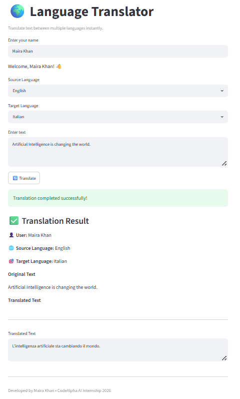

# 🌍 Language Translator

A multilingual text translation application built with Streamlit and Python.

A simple and user-friendly language translation web application built with **Python** and **Streamlit** as part of the **CodeAlpha AI Internship 2026**.

The application allows users to translate text between multiple languages using the `deep-translator` library and Google's translation service.

---

## 📌 Features

- 🌐 Translate text between multiple languages
- 👤 Personalized greeting with user's name
- 🎯 Easy language selection using dropdown menus
- ⚠️ Input validation
  - Prevents empty text submission
  - Prevents selecting the same source and target language
- ⏳ Loading spinner while translating
- ✅ Success and error messages
- 🖥️ Clean and responsive Streamlit interface

---

## 🛠️ Technologies Used

- Python
- Streamlit
- deep-translator
- Git
- GitHub

---


---

## 📂 Project Structure

```
Language-Translator/
│
├── app.py                 # Main Streamlit application
├── translator.py          # Language dictionary
├── requirements.txt
├── README.md
└── LT_screenshots/
    └── app.png
```

---

## 🚀 Installation

Clone the repository:

```bash
git clone https://github.com/MairaKhan-AI/Language-Translator
```

Move into the project folder:

```bash
cd language-translator
```

Install the required packages:

```bash
pip install -r requirements.txt
```

Run the application:

```bash
streamlit run app.py
```

---

## 🌍 Supported Languages

- Arabic
- Chinese
- English
- French
- German
- Hindi
- Italian
- Japanese
- Korean
- Pashto
- Punjabi
- Spanish
- Turkish
- Urdu
- Yoruba

---

## 📸 Screenshots

### Application Interface



---

## 🎯 Learning Outcomes

During this project I learned:

- Building web applications using Streamlit
- Working with translation APIs through `deep-translator`
- Designing interactive user interfaces
- Handling user input and validation
- Exception handling in Python
- Organizing Python projects
- Managing project dependencies using `requirements.txt`
- Creating and documenting GitHub projects

---

## 👩‍💻 Developed By

**Maira Khan**

BS Artificial Intelligence Student

CodeAlpha AI Internship 2026

---

## 📄 License

This project was developed for educational purposes as part of the CodeAlpha AI Internship.